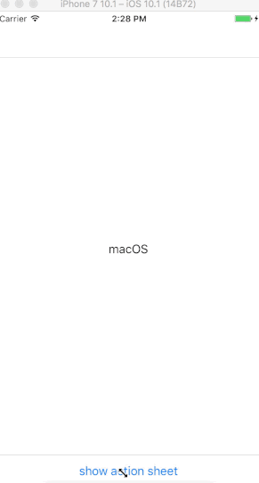

## EkoActionSheetController

[](https://github.com/EkoCommunications/EkoActionSheetController)

<p align="center">
  
</p>

Eko's Custom Action Sheet Controller for iOS

## Installation
*EkoActionSheetController requires iOS 8.0 or later.*

### iOS 8

1.  Drag the code itself (Source folder) to your project.
2.  Make sure that the files are added to the Target membership.

### Using [Carthage](https://github.com/Carthage/Carthage)

1.  Add the `EkoCommunications/EkoActionSheetController` project to your [Cartfile](https://github.com/Carthage/Carthage/blob/master/Documentation/Artifacts.md#cartfile).

        github "EkoCommunications/EkoActionSheetController"

2.  Run `carthage update`, then follow the [additional steps required](https://github.com/Carthage/Carthage#adding-frameworks-to-an-application) to add the iOS and/or Mac frameworks into your project.

## Basic Usage

Import framework.

``` objective-c
@import EkoActionSheetController;
```

Just create EkoActionSheetItem instances and pass them to EkoActionSheetController

``` objective-c
- (IBAction)onButtonTouch:(UIButton *)sender
{
        EkoActionSheetItem *item1 = [EkoActionSheetItem itemWithTitle:@"iOS"
                                                             handler:^(EkoActionSheetItem * _Nonnull item, UIViewController * _Nonnull actionSheetViewController)
                                                            {
                                                                itemActionHandler(item.title, item.image, actionSheetViewController);
                                                            }];

        EkoActionSheetItem *item2 = [EkoActionSheetItem itemWithTitle:@"Android"
                                                              handler:^(EkoActionSheetItem * _Nonnull item, UIViewController * _Nonnull actionSheetViewController)
                                                            {
                                                                itemActionHandler(item.title, item.image, actionSheetViewController);
                                                            }];                                                          

        [EkoActionSheetViewController presentOnViewController:self
                                                        items:@[item1, item2]
                                        headerBackgroundColor:[UIColor purpleColor]
                                           separatorLineColor:[UIColor purpleColor]
                                                        title:@"Select OS"
                                                   cancelItem:nil
                                                    applyItem:nil];

}
```

## Demo

Build and run the `EkoActionSheet Example` project in Xcode to see `EkoActionSheetController` in action.
